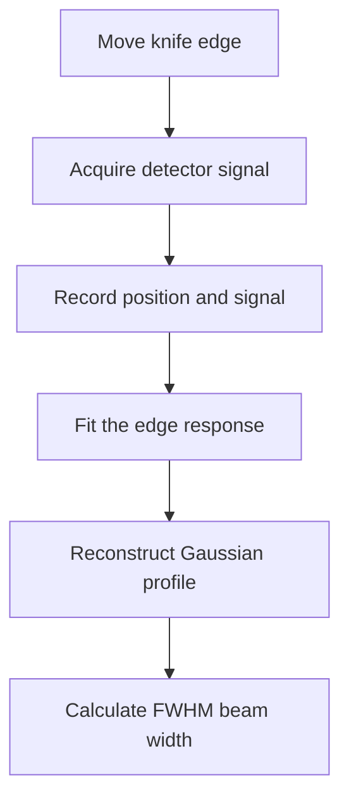

# Automated Laser Beam Diameter Measurement

This repository contains a Python–LabVIEW workflow for automated knife-edge measurement of visible and tunable-infrared laser beams. A motorized translation stage moves a knife edge across the beam while LabVIEW records the detector response. Python coordinates the scan, stores the position and signal data, reconstructs the beam profile, and calculates its full width at half maximum (FWHM), used here as the beam-width metric.

The system was developed for beam characterization and alignment in a picosecond-laser sum-frequency generation (SFG) spectroscopy setup.

> **Project status:** Research prototype. The scripts require configuration for the connected stage, detector, LabVIEW installation, and local data paths before use.

## Measurement workflow



The workflow performs the following steps:

1. Moves an xIMC-compatible motorized translation stage through a defined scan range
2. Calls a LabVIEW virtual instrument to record the detector signal at each position
3. Saves the stage positions and measured signals as a two-column text file
4. Normalizes the knife-edge response and fits it with a sigmoid function
5. Differentiates the fitted edge response to reconstruct the transverse beam profile
6. Fits the reconstructed profile with a Gaussian function
7. Calculates the beam width from

   $$
   \mathrm{FWHM}=2\sqrt{2\ln 2}\,\sigma\approx2.355\sigma
   $$

The analysis scripts can process visible and infrared scans separately or compare both beam profiles at a selected position in the optical path.

## Hardware and software

### Hardware

- Visible or infrared laser beam
- Knife edge mounted on a motorized translation stage
- Translation-stage controller compatible with the xIMC API
- Optical power or energy detector
- Data-acquisition hardware connected to LabVIEW

### Software

- Windows
- Python 3
- LabVIEW
- xIMC software development kit and compatible device drivers
- NumPy
- SciPy
- Matplotlib
- pywin32

The acquisition workflow is Windows-specific because it communicates with LabVIEW through COM automation and loads xIMC dynamic-link libraries.

## Repository contents

| File | Purpose |
| --- | --- |
| `test_focal.py` | Coordinates stage motion and LabVIEW detector acquisition and saves the scan data |
| `analysis.py` | Fits an individual knife-edge scan and calculates the Gaussian FWHM beam width |
| `compVISandIR.py` | Compares fitted visible and infrared beam profiles |
| `compVISandIR copy.py` | Comparison workflow with separate visible and infrared optical-path positions |
| `gaussinfitting.py` | Development version of the edge-response and Gaussian-fitting workflow |
| `testpython.py` | Discovers, opens, tests, and moves the xIMC-controlled stage |
| `pyximc.py` | Python interface definitions for the xIMC library |
| `Example - Single Measurement.vi` | LabVIEW virtual instrument used to acquire one detector reading |
| `libximc*`, `xiwrapper.dll`, `bindy.dll` | Platform-specific xIMC libraries and supporting files |

## Installation

Clone the repository:

```bash
git clone https://github.com/arunakumarasiri/laser-beam-diameter-measurements.git
cd laser-beam-diameter-measurements
```

Create and activate a Python virtual environment on Windows:

```powershell
python -m venv .venv
.venv\Scripts\Activate.ps1
```

Install the Python dependencies:

```powershell
python -m pip install numpy scipy matplotlib pywin32
```

Install the xIMC SDK and ensure that the libraries matching your Python and Windows architecture are available to `pyximc.py`. The repository includes several xIMC library files, but a different controller, operating system, or architecture may require the corresponding files from the device manufacturer.

## Configuration

Before running an automated scan:

1. Connect the translation stage and confirm that it is detected by the xIMC interface
2. Open LabVIEW and verify that `Example - Single Measurement.vi` returns a detector reading
3. Update the VI path inside `labViewLogging()` in `test_focal.py`
4. Replace the hard-coded input and output directories with paths available on your computer
5. Set the beam identifier, scan increment, optical-path position, and stage limits
6. Verify the direction of travel, software limits, physical clearance, and starting position

The principal scan settings in `test_focal.py` are:

```python
beamType = "IR_3150"
stepSize = 20
linearPos = "7.5_5"
```

The call to `stepScan()` defines the start position, end position, and increment. Confirm these values for your stage before executing the script.

## Usage

### 1. Acquire a knife-edge scan

After verifying the hardware configuration and stage limits, run:

```powershell
python test_focal.py
```

The script moves the stage through the configured range, records one detector measurement at each position, and saves the resulting position–signal dataset as a text file.

### 2. Determine the beam width

Set the input data path and scan parameters in `analysis.py`, then run:

```powershell
python analysis.py
```

The script generates a 600 dpi figure containing the measured edge response, its fitted curve, the reconstructed Gaussian beam profile, and the calculated FWHM beam width. It also prints the fitted Gaussian parameters and FWHM to the terminal.

### 3. Compare visible and infrared beams

Configure the data paths and measurement positions in `compVISandIR.py`, then run:

```powershell
python compVISandIR.py
```

This produces an overlaid comparison of the fitted visible and infrared beam profiles and reports their FWHM widths.

## Current limitations

- File paths and experimental settings are currently defined directly in the scripts
- Acquisition requires Windows, LabVIEW, the measurement VI, and compatible xIMC hardware
- `testpython.py` performs stage communication and motion when imported; review its commands before running `test_focal.py`
- The analysis assumes an approximately Gaussian transverse beam profile and fits a sigmoid approximation to the knife-edge response
- The reported beam width is the Gaussian FWHM, not the ISO 11146 $1/e^2$ beam diameter
- Measurement accuracy depends on knife-edge alignment, stage calibration, scan increment, detector linearity, and signal stability
- Uncertainty estimation and automated quality checks are not yet implemented

## Safety

Use appropriate laser eyewear, beam enclosures, and laboratory interlocks. Before automated motion, confirm the translation-stage limits and ensure that the knife edge, detector, optics, and cables cannot collide or obstruct the stage.

## Author

[Aruna Kumarasiri](https://github.com/arunakumarasiri)
